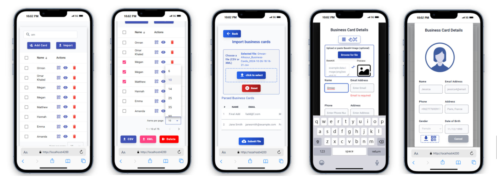
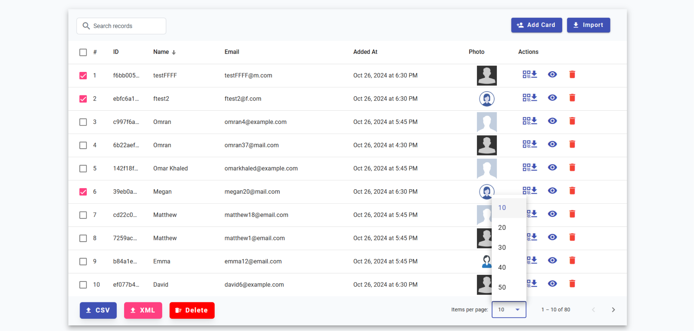
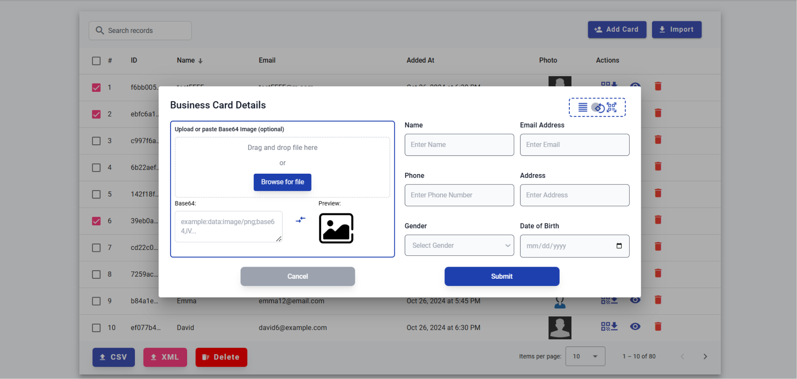
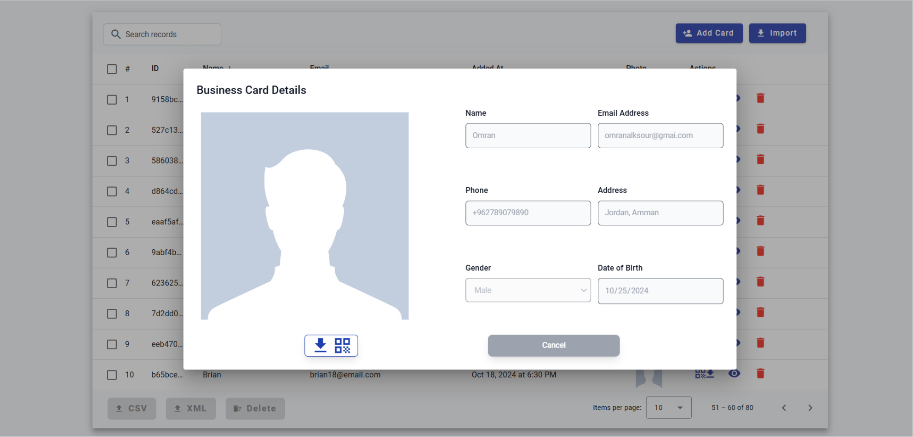
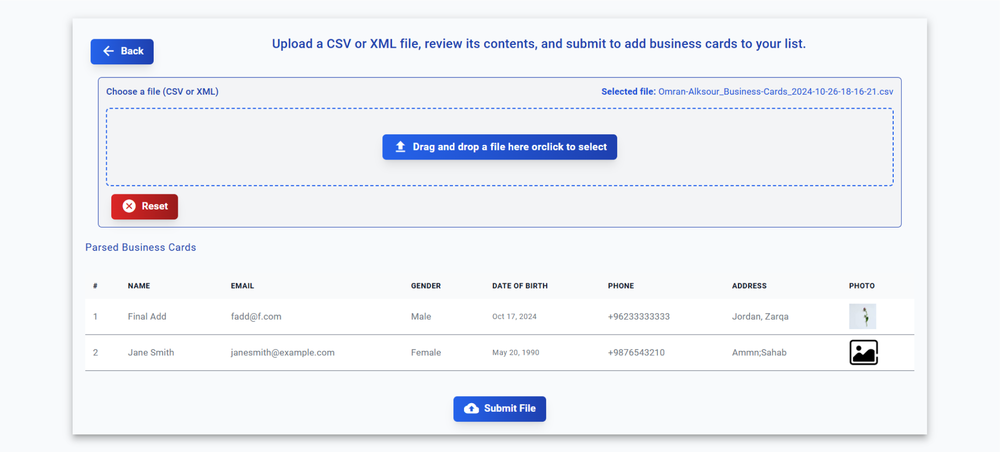
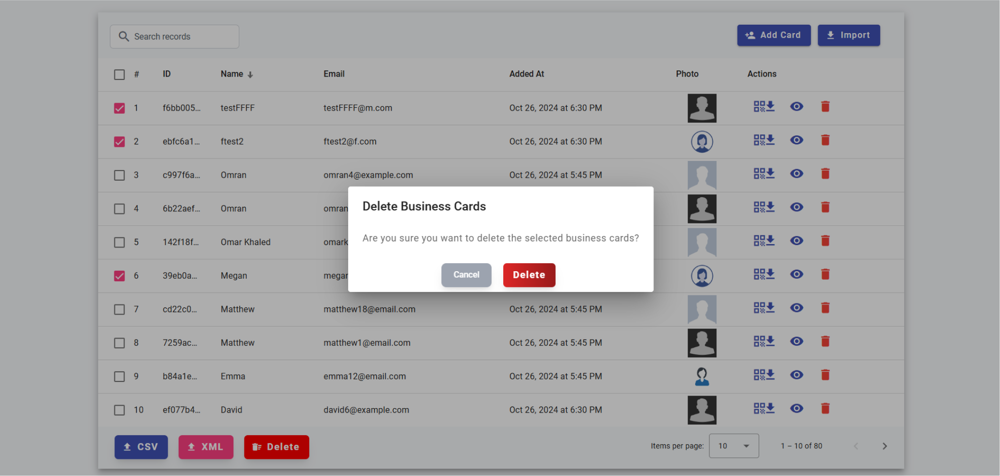
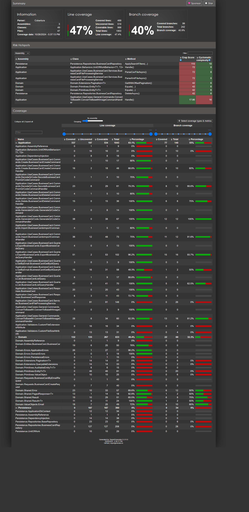

# Business Catalogue
## Project Overview
The **Business Catalogue** application enables efficient management of business cards with advanced features like importing/exporting, QR code generation, image processing, and data filtering. The app offers a seamless experience with a fully responsive and modern design, ideal for various devices and screen sizes.

## Technologies and Libraries

<details>
  <summary><strong>Backend</strong></summary>
  
  - **Framework**: .NET 8
  - **Database**: SQL Server (using Entity Framework Core)
  - **API Documentation**: Swagger
  - **Testing**: xUnit, Moq, Coverlet
</details>

<details>
  <summary><strong>Frontend</strong></summary>
  
  - **Framework**: Angular 17
  - **Styling**: Tailwind CSS for a responsive and modern design
  - **Features**:
    - Drag and Drop support for file uploads
    - Interactive, easy-to-use forms with validation
    - Angular Material for consistent and accessible UI components
</details>

---
#### Table of Contents

- [Business Catalogue](#business-catalogue)
  - [Project Overview](#project-overview)
  - [Technologies and Libraries](#technologies-and-libraries)
      - [Table of Contents](#table-of-contents)
  - [UI](#ui)
    - [1. Mobile](#1-mobile)
    - [2. List](#2-list)
    - [3. Add New Card](#3-add-new-card)
    - [4. View Card](#4-view-card)
    - [5. Import](#5-import)
    - [6. Popup](#6-popup)
  - [Installation and Setup](#installation-and-setup)
    - [Prerequisites](#prerequisites)
    - [Clone the Repository](#clone-the-repository)
      - [Backend](#backend)
      - [Frontend](#frontend)
    - [Database Setup](#database-setup)
    - [Running the Backend](#running-the-backend)
    - [Option 1: Run the Project Using Visual Studio 2022](#option-1-run-the-project-using-visual-studio-2022)
    - [Option 2: Use `dotnet` CLI with Launch Profile](#option-2-use-dotnet-cli-with-launch-profile)
    - [Running the Frontend](#running-the-frontend)
  - [Key API Endpoints](#key-api-endpoints)
  - [Implementation Details](#implementation-details)
    - [Architecture \& Patterns](#architecture--patterns)
    - [API Documentation with Swagger](#api-documentation-with-swagger)
  - [Responsive Design and User Interface](#responsive-design-and-user-interface)
  - [Testing](#testing)
    - [Testing Overview](#testing-overview)
    - [Accessing Test Results](#accessing-test-results)
    - [Test Results](#test-results)
  - [](#)
    - [Testing Resources](#testing-resources)
  - [Database File](#database-file)

---
---
## UI

### 1. Mobile 


### 2. List 


### 3. Add New Card 


### 4. View Card 


### 5. Import 


### 6. Popup 


## Installation and Setup

### Prerequisites

1. Ensure the following are installed on your system:
   - **.NET Core SDK**
   - **Angular CLI**
   - **SQL Server** (Preferred)

### Clone the Repository

#### Backend 
- SSH
```bash
git clone git@github.com:Omran-Alksour/BusinessCards_Services.git
```
- HTTPS
```bash
git clone https://github.com/Omran-Alksour/BusinessCards_Services.git
```
#### Frontend
- SSH

```bash
git clone git@github.com:Omran-Alksour/BusinessCards_Consumer.git
```
- HTTPS
```bash
git clone https://github.com/Omran-Alksour/BusinessCards_Consumer.git
```
<hr>

### Database Setup

1. **Import the Sample Database**:
   - **Recommended**: Restore the provided `.bak` file for SQL Server for an easy and accurate setup. You can find the `.bak` file in [Database Dump And Testing Resources](https://github.com/Omran-Alksour/BusinessCards_Services/commit/9015f69c6965f4ba1612ce7956624118ddf7650f).
   - **Alternative**: If needed, use the `other/database/Option_2__SQL_Script_with_data/BusinessCardsCatalog_Script.sql` file for a script-based setup.
   - Ensure your database configuration matches the connection string in `appsettings.json`.

2. **Running Migrations** (Optional):
   - As an alternative to using the provided database files, you can create the database structure by running migrations:


> **Note**: Using the `.bak` or `.sql` file  for a restore is the recommended approach. 
> Running migrations provides flexibility but may vary based on your environment.


### Running the Backend
> **Note**: Ensure the connection string is correctly configured in the `appsettings.json` file within the backend project to connect to your preferred database.

### Option 1: Run the Project Using Visual Studio 2022

1. **Open the Solution in Visual Studio**:
   - Open **Visual Studio 2022** and load the solution file (`.sln`) for the project.

2. **Select the Correct Launch Profile**:
   - Go to the dropdown next to the **Run** (Play) button at the top. Choose the **IIS Express** profile to run using IIS Express settings, or select **http** or **https** as defined in `launchSettings.json`.
   - Visual Studio will automatically configure the ports and open the browser with the specified URL (e.g., `http://localhost:5257` or `https://localhost:7017`).

3. **Run the Project**:
   - Click on the **Run** button or press **F5** to start the project with the correct URLs, ports, and SSL settings based on the profile.

### Option 2: Use `dotnet` CLI with Launch Profile
Alternatively, run the project with the desired profile from the **dotnet CLI**, specifying the profile from `launchSettings.json` to configure the correct ports automatically.
<hr>

### Running the Frontend

1. Navigate to the frontend directory:
   ```bash
   cd BusinessCards_Consumer
   ```

2. Install required packages:
   ```bash
   npm install
   ```

3. Start the Angular development server:
   ```bash
   ng serve --o
   ```

> **Note**: Ensure you have Angular 17 installed for compatibility.

---

## Key API Endpoints

1. **Create a Business Card** - `POST /api/BusinessCard`  
   Adds a new business card to the catalogue using a `BusinessCardCreateRequest` payload.

2. **Import Business Cards** - `POST /api/BusinessCard/import`  
   Imports multiple business cards from a CSV or XML file with validation capability.

3. **Get Business Card by ID** - `GET /api/BusinessCard/{id}`  
   Retrieves a specific business card based on its unique identifier.

4. **List Business Cards** - `GET /api/BusinessCard`  
   Retrieves a paginated list of business cards, supporting filtering by search terms, sorting, and optional inclusion of Base64-encoded images.

5. **Delete Business Cards** - `DELETE /api/BusinessCard`  
   Deletes a list of business cards by IDs with an option for soft and forced deletion.


6. **Export Business Cards** - `GET /api/BusinessCard/export`  
   Exports selected or all business cards in CSV or XML format with optional ID filtering and file download support.

7. **Convert Image to Base64** - `POST /api/BusinessCard/convertImageToBase64`  
   Converts an uploaded image (PNG, JPG, JPEG, GIF) to a Base64 string with a 1MB file size limit.

8. **Generate QR Code for Business Card** - `POST /api/BusinessCard/generateQrCode`  
   Generates a QR code based on provided business card details and returns it as a downloadable PNG file.

9. **Decode Business Card QR Code** - `POST /api/BusinessCard/decodeQrCode`  
   Decodes the encoded business card data from an uploaded QR code image (PNG, JPG, JPEG, GIF).
   


---

## Implementation Details

### Architecture & Patterns

The **Business Catalogue** backend is crafted using **Clean Architecture** and **Domain-Driven Design (DDD)** principles to ensure scalability, maintainability, and testability across the application. The following design patterns and architectural techniques are applied to create a robust and modular solution:

- **CQRS (Command Query Responsibility Segregation)**: Divides read and write operations, optimizing the performance and scalability of each.
- **Repository Pattern**: Abstracts data access, enabling a clear separation of concerns and consistent data management practices.
- **Result Pattern**: Provides structured success and failure handling, enhancing error management and simplifying response structures.
- **Mediator Pattern**: Uses MediatR to handle complex workflows and reduces coupling by managing dependencies within application layers.
- **Unit of Work Pattern**: Maintains database transaction integrity by coordinating multiple repository actions within a single transaction.
- **Reusable Attributes**: Defines custom attributes to handle validation and input restrictions, minimizing redundancy and increasing validation clarity.
- **Dependency Injection**: Ensures seamless dependency management, promoting flexibility, testability, and loose coupling across components.


<details>
  <summary><strong>1. Create a Business Card - POST /api/BusinessCard</strong></summary>

  - **Description**: Adds a new business card to the catalogue.
  - **Request Body**:
    ```json
    {
      "name": "John Doe",
      "gender": 1,
      "dateOfBirth": "1990-01-01",
      "email": "john.doe@example.com",
      "phoneNumber": "+123456789",
      "address": "123 Main St, City, Country",
      "photo": "Optional base64"
    }
    ```
</details>

<details>
  <summary><strong>2. Get Business Card by ID - GET /api/BusinessCard/{id}</strong></summary>

  - **Description**: Retrieves a specific business card based on its unique ID.
</details>

<details>
  <summary><strong>3. List Business Cards - GET /api/BusinessCard</strong></summary>

  - **Description**: Retrieves a paginated list of all business cards with optional filtering, sorting, and pagination.
  - **Query Parameters**:
    - `pageNumber` (optional): The page to retrieve, default is 1.
    - `pageSize` (optional): Number of records per page, default is 10.
    - `search` (optional): A search term for fields like name,phone,DOB,Gender and email.
    - `orderBy` (optional): Field to order by, e.g., `Name` or `LastUpdateAt`.
    - `orderDirection` (optional): Sorting direction, either `asc` or `desc`.
</details>

<details>
  <summary><strong>4. Import Business Cards - POST /api/BusinessCard/import</strong></summary>

  - **Description**: Imports multiple business cards from a CSV or XML file with validation and preview options.
  - **Supported Formats**: `.csv`, `.xml` (supports UTF-16 for XML files with special characters).
  - **Response**: Returns a report indicating success or failure for each record in the file.
</details>

<details>
  <summary><strong>5. Export Business Cards - GET /api/BusinessCard/export</strong></summary>

  - **Description**: Exports business cards in CSV or XML format with filtering, sorting, and selection options.
  - **Query Parameters**: Supports dynamic ordering by fields like `Name`, with optional selection by IDs.
</details>

### API Documentation with Swagger

Swagger is configured for easy exploration and testing of all endpoints. 

---

## Responsive Design and User Interface

The Frontend, built with **Angular 17** and **Tailwind CSS**, ensures a fully responsive and modern design. The interface adapts to various screen sizes, providing an intuitive experience with drag-and-drop file uploads, real-time previews, and interactive forms for both desktop and mobile users.

- **Listing Page**: This page provides a comprehensive view of all business cards with advanced features like sortable columns, search capabilities, and pagination with adjustable page sizes. Users can multi-select records for actions such as exporting to CSV/XML, bulk deleting, and downloading individual records as QR codes.

- **Import Page**: Designed for importing business cards in bulk, this page supports file upload via drag-and-drop or file selection. It provides a preview of uploaded CSV/XML files, validates data integrity, and offers a detailed import report for each record.

- **Add Business Card Form**: This form allows users to add new business cards, featuring automatic field-filling when a QR code is scanned or provided. The form includes image upload options with immediate previews and supports base64 input, ensuring data validation across all fields.

- **View Existing Card**: Displays detailed information of a selected business card. Users can download the card’s QR code, view contact details, and utilize additional options for editing or managing the card.

Each page is designed to support efficient workflows and simplify business card management, with a fully responsive layout and seamless user experience.

---
## Testing

### Testing Overview

Testing is a critical part of our development process to ensure that the Business Catalogue application is reliable, maintains high code quality, and adheres to design principles.

- **xUnit**: For unit testing individual components and services.
- **Moq**: For mocking dependencies and ensuring isolated testing.
- **Coverlet**: For measuring test coverage and identifying untested parts of the code.
- **ReportGenerator**: For generating a visual HTML report from Coverlet’s coverage results.

**Test Summary**:
- **Number of Unit Tests**: 45+
- **Code Coverage**: Coverage includes all major components and critical paths in the codebase.
- **Architectural Validation**: Ensures compliance with Clean Architecture and DDD principles.

### Accessing Test Results
The test coverage report is available in HTML format for easy review. You can access it [here](Application.Tests/TestResults/CoverageReport/index.html).

###  Test Results 

---

### Testing Resources
I have provided sample testing resources such as CSV and XML files, QR code images, and base64 images for easier testing and verification of application functionalities. You can access these files in [the provided testing resources folder](path/to/testing-resources).

## Database File

- **SQL/Oracle Dump**: Provides SQL Server `.bak` file and an alternative SQL script: [Database Dump And Testing Resources](https://github.com/Omran-Alksour/BusinessCards_Services/commit/9015f69c6965f4ba1612ce7956624118ddf7650f)


